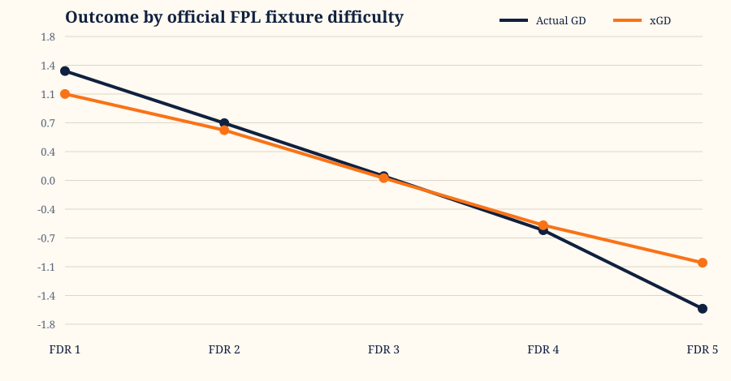
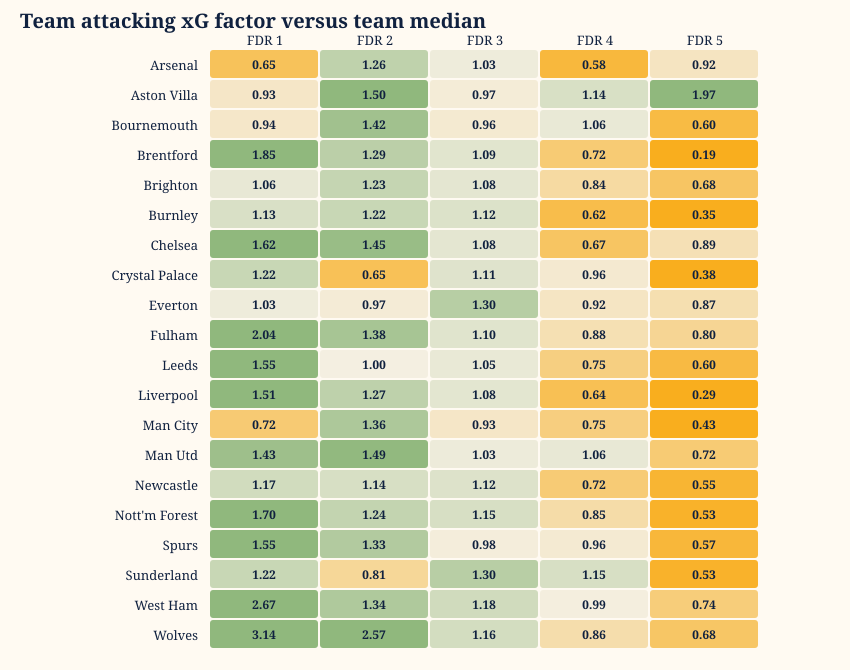

# FDR calibration analysis: 2025-26

## Executive summary

This analysis compares official FPL fixture difficulty with realised goal difference (GD) and expected-goal difference (xGD) for all 380 Premier League matches. Each match is represented from both teams' perspectives, producing 760 observations.

The official ratings show a monotonic relationship with xGD from FDR 1 through FDR 5. The team-relative xGD classification has 25.1% exact agreement and 70.7% agreement within one level of official FDR.

## Official FDR calibration

| FDR | N | Goals for | Goals against | GD | xG | xGA | xGD | Attack factor |
|---:|---:|---:|---:|---:|---:|---:|---:|---:|
| 1 | 38 | 2.11 | 0.74 | +1.37 | 1.83 | 0.75 | +1.08 | 1.42 |
| 2 | 95 | 1.69 | 0.98 | +0.72 | 1.71 | 1.08 | +0.63 | 1.29 |
| 3 | 456 | 1.39 | 1.34 | +0.05 | 1.42 | 1.39 | +0.03 | 1.09 |
| 4 | 133 | 1.08 | 1.70 | -0.62 | 1.10 | 1.66 | -0.56 | 0.86 |
| 5 | 38 | 0.66 | 2.26 | -1.61 | 0.84 | 1.87 | -1.03 | 0.66 |

The attack factor is match xG divided by that team's median xG, then averaged within each official FDR. It is diagnostic only and is not used by the predictor.

Official observation counts: FDR 1: 38, FDR 2: 95, FDR 3: 456, FDR 4: 133, FDR 5: 38.

## Forward-looking factor tests

The team baseline for each fixture uses only that team's earlier xG, shrunk by five matches toward the prior league mean. Because Official FDR incorporates some venue information, the venue tests below are deliberately mild residual adjustments applied on top of the current predictor factors. Monotonic fitted factors are constrained to `FDR1 >= FDR2 >= FDR3 >= FDR4 >= FDR5` and normalised to FDR3 = `1.0`. The team-specific method uses a 10-match prior to shrink each team/FDR cell toward the pooled league factor.

The GW1-19 fit produced: `FDR 1: 1.261, FDR 2: 1.175, FDR 3: 1.000, FDR 4: 0.766, FDR 5: 0.531`.

| Evaluation | Method | N | xG MAE | xG RMSE | Goal MAE | Goal RMSE |
|---|---|---:|---:|---:|---:|---:|
| GW10-38 rolling | Current predictor + venue +/-0.06 | 580 | 0.552 | 0.706 | 0.881 | 1.089 |
| GW10-38 rolling | Current predictor + venue +/-0.04 | 580 | 0.552 | 0.707 | 0.881 | 1.089 |
| GW10-38 rolling | Current predictor + venue +/-0.02 | 580 | 0.553 | 0.708 | 0.881 | 1.090 |
| GW10-38 rolling | Full-season observed (hindsight) | 580 | 0.554 | 0.711 | 0.882 | 1.092 |
| GW10-38 rolling | Current predictor + venue +/-0.00 | 580 | 0.554 | 0.711 | 0.882 | 1.092 |
| GW10-38 rolling | Expanding fitted team-shrunk | 580 | 0.556 | 0.718 | 0.886 | 1.095 |
| GW10-38 rolling | Expanding fitted | 580 | 0.557 | 0.718 | 0.885 | 1.094 |
| GW10-38 rolling | Mild preset | 580 | 0.565 | 0.722 | 0.898 | 1.102 |
| GW10-38 rolling | Neutral 1.0 | 580 | 0.582 | 0.743 | 0.914 | 1.119 |
| GW20-38 holdout | GW1-19 fitted | 380 | 0.525 | 0.678 | 0.866 | 1.066 |
| GW20-38 holdout | Current predictor + venue +/-0.02 | 380 | 0.525 | 0.675 | 0.866 | 1.064 |
| GW20-38 holdout | Full-season observed (hindsight) | 380 | 0.525 | 0.676 | 0.867 | 1.065 |
| GW20-38 holdout | Current predictor + venue +/-0.00 | 380 | 0.525 | 0.677 | 0.867 | 1.065 |
| GW20-38 holdout | GW1-19 fitted team-shrunk | 380 | 0.525 | 0.679 | 0.869 | 1.068 |
| GW20-38 holdout | Current predictor + venue +/-0.04 | 380 | 0.525 | 0.674 | 0.865 | 1.063 |
| GW20-38 holdout | Current predictor + venue +/-0.06 | 380 | 0.527 | 0.675 | 0.865 | 1.063 |
| GW20-38 holdout | Mild preset | 380 | 0.538 | 0.690 | 0.883 | 1.076 |
| GW20-38 holdout | Neutral 1.0 | 380 | 0.557 | 0.712 | 0.898 | 1.093 |

The full-season observed mapping is included only as a hindsight benchmark. It is not a valid candidate for selection because it uses outcomes from the evaluation period.

## Quintile comparison

Global realised-GD quintile boundaries are `[-1.0, 0.0, 0.0, 1.0]`. Global xGD boundaries are `[-1.042, -0.27, 0.27, 1.042]`. Lower outcome-quintile numbers mean easier/better realised fixtures, matching FPL's direction.

| Outcome classification | Exact FDR match | Within one level | Spearman |
|---|---:|---:|---:|
| Global GD quintile | 24.2% | 67.5% | 0.330 |
| Global xGD quintile | 24.9% | 70.9% | 0.380 |
| Team-relative GD quintile | 22.4% | 67.5% | 0.330 |
| Team-relative xGD quintile | 25.1% | 70.7% | 0.393 |

Rank-based quintiles are used for the classifications so every group has similar size. Numeric GD boundaries are highly tied: 14 of 20 teams have fewer than four distinct GD cut points. This confirms that actual GD is too discrete to define five stable production levels by itself.

### Team-relative GD confusion matrix

| Official FDR \ Outcome quintile | 1 | 2 | 3 | 4 | 5 |
|---:|---:|---:|---:|---:|---:|
| 1 | 20 | 7 | 8 | 3 | 0 |
| 2 | 35 | 17 | 19 | 15 | 9 |
| 3 | 97 | 108 | 79 | 99 | 73 |
| 4 | 7 | 26 | 28 | 34 | 38 |
| 5 | 1 | 2 | 6 | 9 | 20 |

### Team-relative xGD confusion matrix

| Official FDR \ Outcome quintile | 1 | 2 | 3 | 4 | 5 |
|---:|---:|---:|---:|---:|---:|
| 1 | 22 | 8 | 6 | 2 | 0 |
| 2 | 38 | 24 | 14 | 12 | 7 |
| 3 | 89 | 111 | 89 | 95 | 72 |
| 4 | 11 | 15 | 24 | 39 | 44 |
| 5 | 0 | 2 | 7 | 12 | 17 |

## Team-specific attacking factors

| Team | FDR 1 | FDR 2 | FDR 3 | FDR 4 | FDR 5 |
|---|---:|---:|---:|---:|---:|
| Arsenal | 0.65 (n=2) | 1.26 (n=5) | 1.03 (n=24) | 0.58 (n=6) | 0.92 (n=1) |
| Aston Villa | 0.93 (n=2) | 1.50 (n=5) | 0.97 (n=23) | 1.14 (n=6) | 1.97 (n=2) |
| Bournemouth | 0.94 (n=2) | 1.42 (n=5) | 0.96 (n=23) | 1.06 (n=6) | 0.60 (n=2) |
| Brentford | 1.85 (n=2) | 1.29 (n=5) | 1.09 (n=22) | 0.72 (n=7) | 0.19 (n=2) |
| Brighton | 1.06 (n=2) | 1.23 (n=5) | 1.08 (n=23) | 0.84 (n=6) | 0.68 (n=2) |
| Burnley | 1.13 (n=1) | 1.22 (n=4) | 1.12 (n=24) | 0.62 (n=7) | 0.35 (n=2) |
| Chelsea | 1.62 (n=2) | 1.45 (n=5) | 1.08 (n=22) | 0.67 (n=7) | 0.89 (n=2) |
| Crystal Palace | 1.22 (n=2) | 0.65 (n=5) | 1.11 (n=22) | 0.96 (n=7) | 0.38 (n=2) |
| Everton | 1.03 (n=2) | 0.97 (n=5) | 1.30 (n=22) | 0.92 (n=7) | 0.87 (n=2) |
| Fulham | 2.04 (n=2) | 1.38 (n=5) | 1.10 (n=22) | 0.88 (n=7) | 0.80 (n=2) |
| Leeds | 1.55 (n=2) | 1.00 (n=4) | 1.05 (n=23) | 0.75 (n=7) | 0.60 (n=2) |
| Liverpool | 1.51 (n=2) | 1.27 (n=5) | 1.08 (n=23) | 0.64 (n=6) | 0.29 (n=2) |
| Man City | 0.72 (n=2) | 1.36 (n=5) | 0.93 (n=24) | 0.75 (n=6) | 0.43 (n=1) |
| Man Utd | 1.43 (n=2) | 1.49 (n=5) | 1.03 (n=23) | 1.06 (n=6) | 0.72 (n=2) |
| Newcastle | 1.17 (n=2) | 1.14 (n=5) | 1.12 (n=22) | 0.72 (n=7) | 0.55 (n=2) |
| Nott'm Forest | 1.70 (n=2) | 1.24 (n=5) | 1.15 (n=22) | 0.85 (n=7) | 0.53 (n=2) |
| Spurs | 1.55 (n=2) | 1.33 (n=5) | 0.98 (n=22) | 0.96 (n=7) | 0.57 (n=2) |
| Sunderland | 1.22 (n=2) | 0.81 (n=4) | 1.30 (n=23) | 1.15 (n=7) | 0.53 (n=2) |
| West Ham | 2.67 (n=2) | 1.34 (n=4) | 1.18 (n=23) | 0.99 (n=7) | 0.74 (n=2) |
| Wolves | 3.14 (n=1) | 2.57 (n=4) | 1.16 (n=24) | 0.86 (n=7) | 0.68 (n=2) |

These factors are noisy because each team/FDR cell contains only a small number of matches. See `team_fdr_factors.csv` for sample counts, xGA factors, medians and means.

## Interpretation and limitations

- This is an end-of-season calibration analysis, not a leakage-free predictive backtest. The archive contains final official fixture ratings and does not prove that every rating is the value published immediately before kickoff.
- Realised GD and xGD are outcomes. They can test FDR but must not be used as pre-match features for the same fixtures.
- Actual GD is discrete and tie-heavy. xGD provides a more stable ordering but is still noisy at team/FDR level.
- Team-specific cells should be partially pooled toward league-wide factors before implementation. One season is insufficient for unrestricted 20-team by 5-level parameters.
- xG and xGA should be modelled separately. GD alone cannot supply both attacking and clean-sheet adjustments.
- The residual venue candidates test symmetric home/away factors on top of the current predictor's FDR mapping. The selected 1.04 home / 0.96 away adjustment is intentionally small because FDR already contains venue information.

## Files

- `team_fixture_observations.csv`: all 760 team-perspective records.
- `official_fdr_calibration.csv`: league-wide outcomes by official FDR.
- `quintile_comparison.csv`: agreement and rank-correlation summary.
- `quintile_confusion_matrix.csv`: official FDR versus each realised quintile classification.
- `team_quintile_breaks.csv`: each team's numeric GD/xGD cut points.
- `team_fdr_factors.csv`: team-specific attacking and defensive factors.
- `factor_backtest_summary.csv`: holdout and rolling-origin accuracy by factor method.
- `factor_backtest_predictions.csv`: every forward prediction used in those scores.
